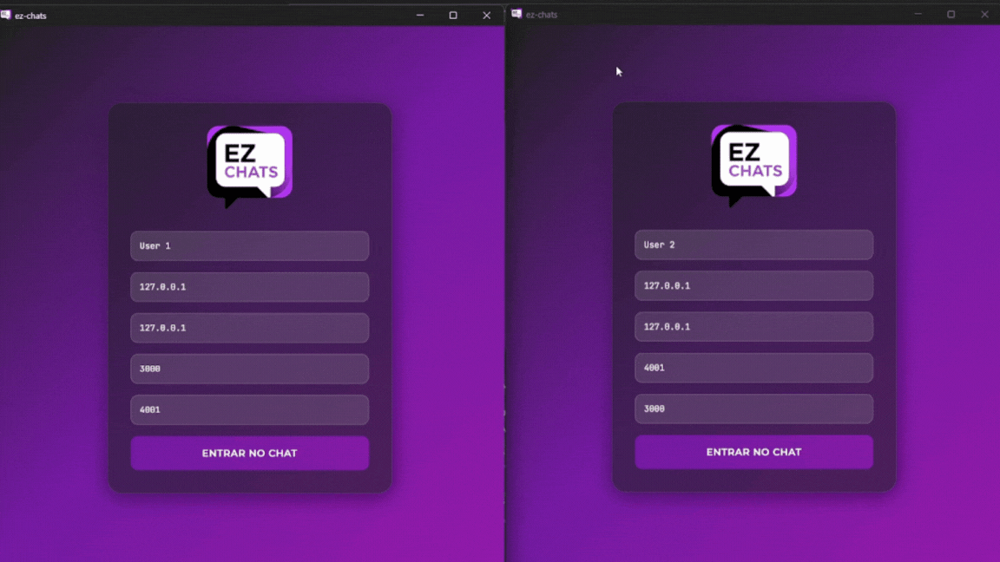

<p align="center">
    
</p>


[](https://github.com/Black-Oper/EzChats/releases/tag/v0.1.0)

## Sobre o Projeto



### Descrição
EZ Chats é uma aplicação de desktop para troca de mensagens `p2p` que utiliza `webhooks` e tokens `JWT` com segurança `RS256`. Foi desenvolvida completamente do zero, sem depender de bibliotecas prontas para `Base64URL`, `RSA` ou `SHA-256`. O projeto foi construído com o framework `Tauri`, integrando um backend desenvolvido em `Rust` 🦀 com um frontend em `React` ⚛️. Esta aplicação foi desenvolvida como parte de um trabalho acadêmico da matéria de `Criptografia e Segurança`.

### Funcionalidades Principais
- Troca de mensagens em tempo real.
- Autenticação segura de mensagens utilizando tokens `JWT` (assinatura `RS256`).
- Interface de usuário intuitiva construída com `React`.
- Backend robusto e seguro desenvolvido em `Rust`.

### A Importância de Possuir uma Camada de Segurança em uma Aplicação
- **Protege Dados Sensíveis:** Mantém informações como senhas e dados pessoais secretas e ilegíveis para invasores.
- **Garante Integridade:** Assegura que os dados não foram alterados indevidamente.
- **Verifica Identidades:** Confirma que usuários e sistemas são quem dizem ser.
- **Constrói Confiança:** Mostra aos usuários que a segurança deles é levada a sério.
- **Atende a Leis:** Ajuda a cumprir regulamentações de proteção de dados.

### Por que Utilizar RS256?
- 🔑**Assinatura Digital Robusta:** O `RS256` utiliza criptografia assimétrica. Isso significa que uma chave privada é usada para assinar os dados e uma chave pública correspondente é usada para verificar a assinatura. Somente quem possui a chave privada pode gerar uma assinatura válida.
- 🤵**Verificação de Autenticidade:** Garante que a mensagem ou token foi realmente emitido pelo detentor da chave privada e não por um impostor.
- 🔒**Garantia de Integridade:** Assegura que os dados não foram alterados desde que foram assinados. Qualquer modificação nos dados invalidaria a assinatura.
- 🏭**Padrão da Indústria:** É um algoritmo bem estabelecido e recomendado em muitos padrões de segurança, incluindo as especificações para `JWTs` `(RFC 7518)`.
- ❌**Não Repúdio (Non-repudiation):** O emissor não pode negar ter assinado os dados, desde que a chave privada não tenha sido comprometida.

### Por que Rust para Segurança?

`Rust` foi a linguagem escolhida para o backend deste projeto devido ao seu forte foco em segurança e desempenho, características cruciais para aplicações que lidam com criptografia e dados sensíveis. As principais vantagens incluem:

- 🔒**Segurança de Memória Garantida:** O sistema de propriedade (ownership) e o verificador de empréstimos (borrow checker) de `Rust` previnem bugs comuns de gerenciamento de memória (como null pointer dereferences e buffer overflows) em tempo de compilação. Isso elimina uma vasta classe de vulnerabilidades de segurança sem a necessidade de um garbage collector, que poderia introduzir pausas e sobrecarga.
- 🚀**Performance:** `Rust` oferece um desempenho comparável ao `C` e `C++`, o que é vital para operações criptográficas que podem ser computacionalmente intensivas.
- 📦**Ecossistema Crescente:** A linguagem possui um ecossistema em expansão com bibliotecas de alta qualidade (crates) para diversas finalidades, incluindo muitas focadas em criptografia e segurança.

## Comunicação entre Clientes (Endpoints)

### Exemplo de Informações Contidas no Token JWT:
- **Header:**
```Json
{
    "alg": "RS256",
    "typ": "JWT",
    "n": 5655218393941,
    "e": 65537
}
```
- **Payload:**
```Json
{
    "username": "Nome de Usuário",
    "text": "Lorem ipsum dolor sit amet.",
    "timestamp": 1678886400
}
```
## Fluxo do Token JWT
### Geração do Token:


- `Json` do Header e do Payload são convertidos para `Base64url` e concatenados com "."
- É gerada uma cópia dessa string e aplicado o algorítmo `RS256`, utilizando as chaves privadas, para geração da signature
- Por fim, a signature é concatenada no final da string

### Validação do Token:


- A parte do token que contém a string em `Base64url` do header e payload concatenados com ".", é processada pelo algorítmo `SHA-256`, gerando um Hash
- A signature é decodificada com `Base64url`, posteriormente decodificada com `RSA` utilizando as chaves públicas, e por fim, processada pelo `SHA-256`, gerando outro Hash
- É então realizada a comparação dos Hash:

    - Se forem iguais, o `token é válido`!
    - Caso contrário, é inválido

## Instrução de Instalação (Dev)

### Pré requisitos
- `npm 10.9.2^`
- `cargo 1.87.0^`
- `tauri-cli 2.5.0^`

### Etapas
- Execute o comando:
```shell
# Instalar a pasta node_modules
npm install
```

## Instrução de Build (Dev)
- Abra o terminal na pasta raiz do projeto
- Execute o comando:
```shell
# Buildar o Tauri como Desenvolvedor
npm run tauri dev
```

## Meu LinkedIn
https://www.linkedin.com/in/pedro-miguel-radwanski-4741b626a/

## Licença

[MIT](LICENSE) © Pedro Miguel Radwanski
